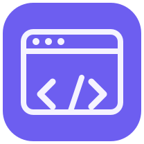
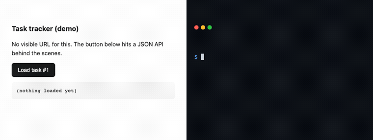

<div align="center">



# iframer

**Give an AI agent a real browser, get an API back.**<br>
Drive a site once and iframer hands the agent the actual request behind it, no devtools, no HAR file.




</div>

Most agent-driven browsers only replay clicks. Every visit to the same page means rendering the whole thing again, screenshot after screenshot, just to read one field off it.

iframer drives a real, stealth-patched Chromium, or your own logged-in Chrome through the extension, and while it does:

- Records the fetch and XHR calls the page makes while it drives it (not static assets), no manual devtools work
- Hands back the real request behind a login form or a button click: method, headers, auth, a working curl
- Generates typed functions ready to `import`, when an agent is doing the driving
- Caches the domain after the first run, so the next visit skips the browser and hits the endpoint directly, seconds down to milliseconds

## Example

The left side of the GIF above is [`docs/example/site/index.html`](docs/example/site/index.html): one button, one hidden API call. The right side is a real terminal, only the typing pace was staged for the recording; the command and its output are exactly what running it produces. Capturing it for real:

```sh
cd docs/example/site && python3 -m http.server 8934 &
iframer-toolkit reverse-engineer '[
  {"type":"navigate","url":"http://localhost:8934/index.html"},
  {"type":"click","selector":"#load"},
  {"type":"wait","ms":1000}
]' --output docs/example/api
```

That produced [`docs/example/api/captured-api.json`](docs/example/api/captured-api.json): the exact request, headers, response body, and a curl command, all automatic, no agent required.

The rest of `docs/example/api/` (`getTodos.ts`, `transport/rest.ts`, `types.ts`, `README.md`) is what an agent writes from that capture: iframer tells it the endpoint's protocol, verb, and function name, and the agent turns that into a typed function. That's what happened here, driven by Claude through the MCP `reverse-engineer` tool.

The whole round trip, one click to one typed endpoint, cost about 590 tokens back to the agent. This is the whole thing you get: no HAR file, no manual devtools work, a function you can call.

## Token cost

Most of iframer's savings come from the snapshot it hands back: capped and filtered, instead of the full accessibility tree other tools dump into context. Measured with the same tokenizer, same steps, on the same three tasks:

| Task | iframer (MCP) | iframer (CLI) | agent-browser | Playwright MCP |
|------|---------------|----------------|----------------|-----------------|
| Wiki link chase (6 hops, Everest → Gojo) | 517 | 721 | 913 | 1,405 |
| Store purchase (login → sort → cart → checkout) | 552 | 697 | 851 | 2,739 |
| Heavy-page recon (GitHub: look + pull 4 facts) | 986 | 1,058 | 8,433 | 19,906 |

The gap grows with how much DOM the page has. On the GitHub page, iframer spent about 986 tokens where Playwright MCP spent about 19,900, roughly 20x. That's per-task cost. It doesn't include the roughly 5.1k tokens of MCP tool-definition overhead loaded once per session, not per task. The harness and fairness rules live in `benchmark/` locally; that folder is gitignored and not published with the repo.

## Install

```sh
npm install -g iframer-toolkit
```

Then pull in the runtime dependencies (Chrome for Testing + MCP registration):

```sh
iframer-toolkit install
```

This is shorthand for:

```sh
iframer-toolkit install chromium   # downloads Chrome for Testing to ~/.iframer
iframer-toolkit install mcp        # registers the MCP server in ~/.claude.json and ~/.codex/config.toml
```

Restart Claude Code or Codex and the `iframer` tools will be available.

To update later:

```sh
iframer-toolkit update             # update via npm (also refreshes the extension if installed)
iframer-toolkit update --check     # just report whether a newer version exists
```

Your agent can also just run `iframer-toolkit install` for you; it figures out the rest.

Ships as:
- **CLI** (`iframer-toolkit` / `iframer`): browse, screenshot, credentials, sessions, reverse-engineer APIs
- **MCP server**: plugs into Claude Code or Codex so agents drive the browser themselves
- **Browser extension** (optional): lets the agent drive tabs in your real Chrome, on your real logged-in session
- **Self-hosted Docker server** (optional): adds live headful browsing over noVNC for remote or multi-user setups

## Quick start

Once installed, drive the browser via the CLI directly, or ask your agent (Claude Code / Codex) to do it through the MCP.

**CLI:**

```sh
iframer-toolkit status                                      # system + browser modes
iframer-toolkit browse https://example.com --extract 'document.title'
iframer-toolkit screenshot https://news.ycombinator.com -o /tmp/hn.png
iframer-toolkit credentials add github.com                  # interactive masked prompt
iframer-toolkit reverse-engineer https://some-spa.com        # capture the APIs it calls
iframer-toolkit --cache                                     # list cached domains
```

**From Claude Code or Codex** (after `install mcp`):

> "Log into my account on example.com and extract the latest invoice."

The agent calls `knowledge` first to check for a cached direct-API path, falls back to `credentials` + `execute` if there isn't one, auto-escalates browser modes if a site blocks headless, and returns the result. No copying cookies, no proxies, no manual login.

## How it works

```
Claude / Codex (MCP) ──▶ iframer MCP server ──▶ shared local server (127.0.0.1)
                                                   ├─ patchright (stealth Chromium)
                                                   ├─ Chrome for Testing
                                                   ├─ your real Chrome (optional, via extension)
                                                   └─ SQLite at ~/.iframer: one file for
                                                      encrypted credentials, session state,
                                                      and per-domain knowledge cache
```

By default, `install mcp` runs in **local mode**, no Docker needed. Both the MCP clients and the `iframer execute` CLI talk to one shared local server (discovered via `~/.iframer/server.json`, loopback only) that keeps a stealth-patched Chromium warm between calls, tracks every browser it spawns in an on-disk PID registry so nothing leaks, and idle-exits when no one needs it. `install mcp` registers the server in both Claude Code (`~/.claude.json`) and Codex (`~/.codex/config.toml`).

**Warm CLI.** `iframer execute` routes to that shared daemon instead of launching a cold browser per invocation, so after the first call it's as fast as the MCP (pass `--in-process` to force a private throwaway browser). Each agent gets its own browser instance, keyed off `CLAUDE_CODE_SESSION_ID` / `TERM_SESSION_ID` or `IFRAMER_INSTANCE`, so concurrent agents never share a window, while all CLI calls share one login session.

**Resuming a task.** The browser and its page persist in the daemon between calls and survive an interrupt (Ctrl-C). Name a multi-step or human-in-the-loop task's browser with a stable `instanceId`, and to resume, run `execute` again with the same `instanceId` and act on the current page (`snapshot` / `read` / `find`). Don't navigate again; that reloads the page and loses state like an OTP screen. `iframer instances` lists the live windows and which page each is on.

**One credential store for every browser mode.** Stored credentials, session cookies/localStorage, and the knowledge cache all live in one SQLite file at `~/.iframer/iframer.db`. Store a password once, from the CLI or the MCP, and every mode (`headless`, `binary-headful`, `docker-headful`) uses the same row.

**Auto-escalation.** When a pipeline is blocked in `headless` (bot detection, captcha), iframer retries in `binary-headful` and then `docker-headful` without a round trip to the agent. The mode that worked is recorded in `~/.iframer/domain-modes.json`, so the next run on that domain starts at the right mode.

**Knowledge cache.** After every successful run, iframer writes a per-domain markdown file at `~/.iframer/knowledge/<domain>.md` recording which cookies, localStorage keys, and headers the site uses for auth, plus any API endpoints seen along the way. The next time an agent needs data from that domain, it reads the cache first; if there's a direct-API path, it skips the browser entirely. See [Knowledge cache](#knowledge-cache) below.

For live remote viewing, multi-user, or Linux server deployments, see [Self-hosting with Docker](#self-hosting-with-docker) below.

## Extension mode: drive your real Chrome

The optional browser extension lets the agent drive a tab you already have open in your real Chrome. No relaunch, no remote-debugging port, your real logged-in session. The extension dials out to iframer's local server and relays the CDP protocol via `chrome.debugger`, so your live tab is driven by the exact same pipeline engine (find, click, snapshot, obstacle handling, API capture) as every other mode, with real trusted input. While a run is active, Chrome shows its yellow "started debugging" bar.

```sh
iframer install extension chrome   # installs the pairing host, prints the folder to load
iframer extension path             # prints it again
```

Then load it once: `chrome://extensions` → Developer mode → **Load unpacked** → the printed folder. Once paired, the agent lists your open tabs with the `tabs` tool and drives the one you mean. Multiple Chrome profiles or browsers can be paired at once; each identifies itself with a profile name, and iframer routes work to the profile that owns the target tab. See [`extension/README.md`](extension/README.md) for details.

## CLI reference

```
iframer-toolkit <command> [args]

Pipeline:
  execute <pipeline.json|json>     Run a pipeline of browser steps
    --mode <mode>                  Force browser mode (headless|binary-headful|docker-headful)
    --capture-api                  Record XHR/fetch requests during execution
    --continue-on-error            Don't stop on step failure
    --timeout <ms>                 Stale-state timeout (default: 20000)
    --json                         Print raw PipelineResult JSON (default: compact agent-readable text)
    --in-process                   Skip the shared warm daemon; run a private in-process browser

Quick actions:
  browse <url>                     Headless fetch with JS rendering
    --extract <js>                 Evaluate JS and return result
    --html                         Return full page HTML
    --wait-for <selector>          Wait for element before extracting
    --sessionless                  Skip session persistence
  screenshot <url>                 Take a screenshot of a URL
    --annotate                     Overlay element badges with refs
    -o, --output <path>            Output file path
  reverse-engineer <url|file>      Capture API calls a site makes
    --output <dir>                 Save directory
    --typed                        Generate TypeScript

Browser windows:
  instances                        List live browser windows (instanceId → current page)
  windows                          Alias of instances

Session:
  session stop                     Save state + close idle browsers on the shared daemon
  session clear                    Wipe stored session data
  session status                   Check session state

Credentials:
  credentials add <domain>         Store login credentials (encrypted)
    --username <user>              Username or email
    --password <pass>              Password (interactive masked prompt if omitted)
    --totp-secret <secret>         TOTP secret for 2FA
  credentials list                 List domains with stored credentials
  credentials remove <domain>      Delete credentials for a domain

Knowledge cache:
  --cache                          List all cached domains
  --cache <domain>                 Print the cached knowledge for one domain
  --clear-cache                    Wipe all cached knowledge
  --clear-cache <domain>           Wipe one domain's cache
  knowledge list                   Same as --cache
  knowledge get <domain>           Same as --cache <domain>
  knowledge clear [domain]         Same as --clear-cache [domain]

Telemetry:
  telemetry                        Report estimated session tokens consumed by MCP tool calls
  telemetry --clear                Wipe the telemetry log

Setup:
  install                          Install everything (Chromium + MCP)
  install chromium                 Download Chrome for Testing
  install mcp [--dev]              Register MCP server in Claude Code and Codex
  install extension chrome         Install the optional browser extension pairing host
  extension path                   Print the extension folder to load in chrome://extensions
  update [--check]                 Update iframer via npm (--check: report only)
  remove [chromium|mcp|extension]  Remove everything, or one piece

Browser:
  modes                            Show available browser modes
  status                            Show system status
```

The binary is available as either `iframer-toolkit` (full name) or `iframer` (short alias). `npx iframer-toolkit ...` also works without a global install.

## MCP tools

Once the MCP is registered, the agent has access to:

- **`status`**: system health, session state, stored credentials, available browser modes
- **`knowledge`**: read/list/clear the per-domain knowledge cache. Agents are told to check this before every `execute` or `browse`; if the cache already has a direct-API path, the browser never launches.
- **`execute`**: run a pipeline of browser steps (navigate, click, right-click, fill, select, human-click, human-type, type-code, read, evaluate, extract, wait, wait-for, scroll, keyboard, upload, paste, download, login, solve-captcha, recaptcha, screenshot, snapshot, find). Each step has a 20s stale-state timeout. On failure, it returns the exact step, error type, and a screenshot of the page at the point of failure. Auto-escalates browser modes on bot-block.
- **`browse`**: fast headless fetch with session persistence for pages that don't need a full pipeline
- **`reverse-engineer`**: capture the APIs a site calls (feeds the knowledge cache so future runs can skip the browser)
- **`remember`**: per-domain element anchors. Save a selector once under a name, then target it as `@a:<name>` in any later pipeline, no re-finding the element on every visit. Anchors self-heal (a failed anchor triggers re-discovery, not blind retries) and the tool also records per-site quirks.
- **`tabs`**: list and target tabs in your real Chrome (requires the [extension](#extension-mode-drive-your-real-chrome))
- **`clipboard`**: read/write the machine's clipboard, the same one your Chrome uses: read a code a site just copied, or stage text to paste into a field via the `paste` step
- **`session`**: `stop` (save state) or `clear` (wipe)
- **`credentials`**: `store` (secure form via MCP elicitation), `list`. `store` refuses to overwrite existing credentials unless told to (`force: true`), which blocks the common "login failed, re-ask for password" mistake when the real problem is browser mode or bot detection.

## Session persistence

Session data (cookies + localStorage) and credentials are stored in SQLite at `~/.iframer/iframer.db` and encrypted with AES-256-GCM. Data is automatically re-injected on the next `execute` or `browse` so agents stay logged in across restarts, and across browser modes: a session captured in `binary-headful` will load into `headless` on the next run.

The encryption key lives at `~/.iframer/secret` (0600 permissions), generated on first `install mcp`. Set `IFRAMER_SECRET` in your environment to override it, useful if you want to sync the key across machines.

## Knowledge cache

Every successful `execute` run updates a plain markdown file at `~/.iframer/knowledge/<domain>.md`, human-readable, grep-able, editable. Each file captures:

- Which cookies, localStorage keys, and headers are load-bearing for authentication (names only; values stay encrypted in the session store)
- Which API endpoints the site called during the run, with method, path, example curl, and status code
- Which browser mode last worked for the domain
- Notes about captcha or bot-detection behavior

The MCP `knowledge` tool exposes this with `get`, `list`, and `clear` actions. Agents are instructed to call it before every browser-touching tool; if the cache already has a direct-API path for the data, the agent hits the API directly and never launches a browser. First request takes seconds, repeat requests on the same domain take milliseconds.

Inspect the cache yourself:

```sh
iframer-toolkit --cache                     # list all cached domains
iframer-toolkit --cache figma.com           # print the markdown for one domain
iframer-toolkit --clear-cache               # wipe all cached knowledge
iframer-toolkit --clear-cache figma.com     # wipe one domain
```

## Captcha solving

iframer detects and solves reCAPTCHA and hCaptcha using Claude's vision API. Use the `solve-captcha` step in a pipeline:

```json
{ "type": "solve-captcha" }
```

Requires `ANTHROPIC_API_KEY` in your environment.

## Environment variables

| Variable            | Required | Description |
|---------------------|----------|-------------|
| `ANTHROPIC_API_KEY` | For captcha | Used for vision-based captcha solving |
| `IFRAMER_SECRET`    | No       | Encryption key for sessions & credentials. Defaults to the value at `~/.iframer/secret` (auto-generated on first `install mcp`). Override in the shell or in `.env` to pin a specific key. |
| `IFRAMER_TELEMETRY` | No       | Set to `0` in the MCP env to disable the local token-telemetry log (`iframer telemetry` reads it). |
| `IFRAMER_LOCAL_PORT`| No       | Base port for the shared local server (default: `3022`, loopback only). |
| `IFRAMER_DATA_DIR`  | No       | Override the data directory. Default: `~/.iframer`. The Docker container sets this to `/iframer-data` so a bind mount makes host and container share one database. |
| `IFRAMER_MODE`      | No       | `local` (default) or `docker`. Force a mode regardless of what's running. |
| `IFRAMER_URL`       | No       | Docker API URL when self-hosting (default: `http://localhost:3021`). |

## Self-hosting with Docker

The Docker server adds a live headful browsing mode over noVNC (watch the agent drive the browser in real time) and lets multiple clients share one browser pool. The Docker path only runs when a pipeline explicitly requests `mode: "docker-headful"`; `headless` and `binary-headful` always run directly on the host even when Docker is up, so host-stored credentials stay visible.

`docker-compose.yml` bind-mounts `~/.iframer` from the host into the container as `/iframer-data` and sets `IFRAMER_DATA_DIR=/iframer-data`, so container and host share the same SQLite file. Credentials stored via the CLI or MCP on the host are immediately visible to `docker-headful`, no copy step.

**1. Clone and configure**

```sh
git clone https://github.com/EduardoFazolo/iframer-toolkit.git
cd iframer-toolkit
cp .env.example .env
# Edit .env: set ANTHROPIC_API_KEY (for captcha) and IFRAMER_SECRET (for auth)
```

**2. Start**

```sh
bun run start:docker   # docker compose up --build -d
bun run logs:docker    # tail container logs
bun run stop:docker    # stop containers
```

**3. Point the MCP at it (remote host only)**

If Docker runs on a remote machine and the MCP on a different one, install the MCP with the remote URL:

```sh
IFRAMER_URL=https://your-host:3021 iframer-toolkit install mcp --dev
```

When Docker is on the same host as the MCP, no extra setup is needed; the local MCP server auto-detects the Docker API on `localhost:3021` and routes only `docker-headful` requests through it.

**4. Watch the browser live**

When a `docker-headful` session is active, open noVNC:

```
http://your-host:6080
```

Or run `iframer-toolkit watch` to auto-open it.

## Architecture

| Component          | Technology |
|--------------------|------------|
| Browser engine     | [patchright](https://github.com/Kaliiiiiiiiii-Vinyzu/patchright) (stealth-patched Playwright fork) |
| Browser binary     | Chrome for Testing (downloaded to `~/.iframer/chrome/`) |
| Local server       | One shared warm server per machine (loopback only, discovered via `~/.iframer/server.json`), on-disk browser PID registry, idle auto-exit |
| Extension mode     | Chrome extension relaying CDP over WebSocket (`chrome.debugger` → `connectOverCDP`), drives tabs in your real Chrome |
| Stealth            | Fingerprint injection, WebRTC leak prevention, worker patching |
| Credential store   | SQLite at `~/.iframer/iframer.db`, AES-256-GCM encrypted, shared by every browser mode |
| Session persistence| Same SQLite file, cookies + localStorage re-injected across runs and modes |
| Knowledge cache    | Plain markdown at `~/.iframer/knowledge/<domain>.md` |
| Captcha solving    | Anthropic vision API (`@anthropic-ai/sdk`) |
| Live viewing       | Xvfb + x11vnc + noVNC + websockify (Docker mode only) |
| MCP server         | `@modelcontextprotocol/sdk` |
| Runtime            | Node.js ≥18 (Bun for development) |

## Repo layout

```
src/lib/            core: pipeline executor, actions, auth, screenshot, knowledge cache
src/mcp/             MCP server + tool definitions
bin/cli.js           CLI entry point
extension/           Chrome extension (manifest v3, CDP relay)
docs/example/        the demo in this README: site/ + captured api/
benchmark/           token-cost benchmark harness vs agent-browser and Playwright MCP (gitignored, local only)
```

## What's not done yet

- Stealth fingerprinting is injected right after the page loads, not at browser-context creation, so a site checking for it in the first tick of navigation can still catch it. This is the main remaining cause of false bot-blocks.
- The knowledge cache's markdown merge can drop an endpoint's description or example fields when the same domain is captured a second time.
- Consent banners rendered inside a cross-origin iframe (common with some CMPs) aren't recognized as an obstacle yet.
- Element anchors (`remember`) still have to be saved by hand after a successful run; auto-saving the selectors that worked isn't wired up.
- A few internal modules (the SQLite adapter, the stealth/humanize helpers) still carry loose `any` types.

## Development

```sh
git clone https://github.com/EduardoFazolo/iframer-toolkit.git
cd iframer-toolkit
bun install

# Run the CLI from source (no build needed, bun runs .ts directly)
bun run bin/cli.js status

# Run the MCP server from source
bun run src/mcp/server.ts

# Run the Docker API server from source (no Docker)
bun run start   # bun run index.ts

# Rebuild the distributable bundles (dist/cli.cjs + dist/mcp-server.cjs)
bun run build

# Install the locally-built package globally for testing
npm pack
npm install -g ./iframer-toolkit-*.tgz
```

`prepublishOnly` runs `bun run build` automatically, so `npm publish` always ships a fresh bundle.

## License

MIT
